<style>

  .green{color:#0e5e00;}
  
  .pink{color:#e61c95;}
  
  .red{color:#b30f04;}
  
  .blue{color: blue;}
  
  .orange{color:orange;}
  
  .purple{color: #6500ad;}
  
  h3, h1 {color: #120075;}
  
  li {line-height: 2; text-align: justify; padding: 5px; }
  
  p{text-align: justify; line-height: 2; padding: 5px;}
  
  body{background-color: #ebebeb;}
  
</style>

<br>

<center><h3><b>Trabalho de grupo: Introdução a Modelos Dinâmicos</b></h3></center>

<br>

<div style="color: white; background-color: #120075; border-radius: 10px; padding: 10px;">

<p style="margin-left: 45%;">ISCTE-IUL</p>
<p style="margin-left: 37%;">Licenciatura em Ciência de Dados</p>
<p style="margin-left: 36%;">U.C. Introdução a Modelos Dinâmicos</p>
<p>Docente: Diana Aldea Mendes</p>
<p>Título:</p>
<p>Previsão da despesa alimentar num agregado familiar Espanhol (por mês)</p>
<br>
<p>Trabalho do grupo 5 realizado por:</p>

<ul>
<li>Bárbara Carvalho, nº92551</li>
<br>
<li>Ricardo Santo, nº93357</li>
<br>
<li>Rodolfo Fernandes, nº93328</li>
<br>
<li>Rodrigo Sarroeira, nº92761</li>
</ul>
<p>Data: 27 de Dezembro 2020</p>
</div>


```{r setup, include=FALSE}
knitr::opts_chunk$set(echo = TRUE)
```

<br>
<div style="margin-left: 30px; margin-right:30px;">
<h3><b>Introdução:</b></h3>

<div style="border: solid; border-width: 1px; border-color: #cccccc; padding: 10px;border-radius: 10px; background-color:white;">

  <p> O presente trabalho tem como objetivo principal determinar os fatores que influenciam a percentagem do          rendimento familiar relativa a alimentação, para efetuar a melhor previsão possível desta variável. Isto        é, o peso do rendimento de um agregado que é gasto em comida.
      Para este efeito, foram utilizados dados de diferentes agregados familiares provenientes de Espanha, com        informação relativa ao número de elementos do agregado familiar, localização, rendimento total e despesas       totais. Estes dados estam contidos num ficheiro csv (BudgetFood.csv). O nosso trabalho não vai incidir          sobre todo o dataset, apenas das linhas 5201 à 6500. Este dataset é constituído por 6 variáveis. Para           estudar a variável target e determinar os componentes que a afetam, vamos utilizar um modelo de regressão       linear múltipla. As variáveis disponíveis para construir esse modelo de regressão linear são: </p>
   
<ul>
  <li>  <b style="width: 15px; height: 15px; background-color: #b30f04; border: solid;                                   border.width: 1px; border-color: lightgrey; color: #b30f04;"> dd </b> - Wfood (target): 
         rácio das despesas em alimentação no orçamento mensal do agregado familiar. </li>
      
  <li>  <b style="width: 15px; height: 15px; background-color: #0e5e00; border: solid; border.width:             1px; border-color: lightgrey; color: #0e5e00;"> dd </b> - totexp: valor do orçamento mensal em pesetas. </li>
      
  <li>  <b style="width: 15px; height: 15px; background-color: orange; border: solid; border.width:               1px; border-color: lightgrey; color: orange;"> dd </b> - size: número de pessoas no agregado familiar. </li>
      
  <li>  <b style="width: 15px; height: 15px; background-color: blue; border: solid; border.width: 1px;            border-color: lightgrey; color: blue;"> dd </b> - age: idade da pessoa de referência do agregado familiar. </li>
      
  <li> <b style="width: 15px; height: 15px; background-color: #6500ad; border: solid; border.width:               1px; border-color: lightgrey; color: #6500ad;"> dd </b> - town: tamanho da cidade onde a família reside.
  (1-pequena, 5-grande)</li>
      
  <li> <b style="width: 15px; height: 15px; background-color: #e61c95; border: solid; border.width: 1px;            border-color: lightgrey; color: #e61c95;"> dd </b> - sex: sexo da pessoa de referência do agregado familiar. </li>
</ul>
  
</div>

<br>
  
```{r include=FALSE}
library(olsrr)
library(corrplot)
library(lmtest)
library(tseries)
library(MASS)
library(car)
library(caTools)
```

<h3><b>Importação do dataset:</b></h3>

<div style="border: solid; border-width: 1px; border-color: #cccccc; padding: 10px;border-radius: 10px; background-color:white;">

  <p> Para importar o dataset para um dataframe `sample` recorremos ao seguinte código: </p>
  
```{r}
BudgetFood =read.csv("BudgetFood.csv")

# Escolha das linhas constituítes da nossa amostra
sample = BudgetFood[c(5201:6500),] 
```
  
</div>

<br>

<h3><b>Transformação e limpeza de dados:</b></h3>

<div style="border: solid; border-width: 1px; border-color: #cccccc; padding: 10px;border-radius: 10px; background-color:white;">

  <p> Nesta primeira secção vamos proceder à transformação de duas variáveis, a <b class=green>totexp</b> e a <b           class=pink>sex</b>.

  <p> Agora vamos criar uma nova variável chamada <b class=pink>sex_bin</b>, que é uma codificação da variável             <b class=pink>sex</b>,
      De valores 0 e um 1, que correspondem a "woman" e a "man", respetivamente. De seguida vamos adicioná-la
      ao dataframe.</p> 

```{r}
sex_bin = sample$sex
sex_bin[sex_bin == "man"] = 1
sex_bin[sex_bin == "woman"] = 0
sex_bin = as.numeric(sex_bin)

sample["sex_bin"] = sex_bin

```      

<br>

<p>A <b class=green>totexp</b> está quantificada em pesetas, para obtermos uma análise mais clara vamos calcular
      o seu valor em euros, sabendo que 6 euros são 1000 pesetas. Vamos criar um vetor                                     <b class=green>totexp_euros</b> com essa informação e adicioná-lo ao nosso dataframe sample.</p>

```{r}
totexp_euros = ( sample$totexp * 6 ) / 1000

sample["totexp_euros"] = totexp_euros
```      
    
<br>

<p style="margin-left: 20%;"> Imagem 1 - Head do dataframe sample </p>
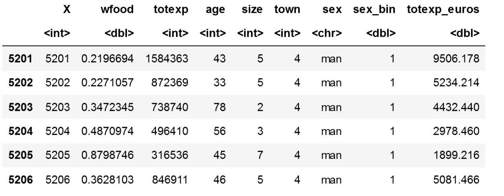

<br>

<p> Na nossa sample encontrámos valores nulos para a variável target <b class="red">wfood</b>, o que não
    faz sentido segundo a abordagem proposta, visto que representa a percentagem de gastos em comida. Dada esta situação decidimos eliminar 
    essa linhas. Abaixo está apresentado o código utilizado. Denominámos o nosso novo dataframe por 
    `cleaned_sample`, neste dataframe já não constam as variáveis <b class=green>totexp</b>
    e <b class=pink>sex</b>.</p>

```{r}
cleaned_sample=sample[sample$wfood!=0,c(1,2,4,5,6,8,9)]

```   

<br>

<p style="margin-left: 20%;"> Imagem 2 - Head do dataframe cleaned_sample </p>
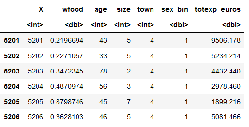

</div>

<br>

<h3><b>Análise descritiva:</b></h3>
<div style="border: solid; border-width: 1px; border-color: #cccccc; padding: 10px;border-radius: 10px; background-color:white;">
<p> Compilámos na tabela da Imagem 3 o tipo de cada variável e algumas medidas estatísticas,
    que obtivemos através dos seguintes comandos:</p>

```{r}
str = str(cleaned_sample)
summary = summary(cleaned_sample)
```   

<br>

<p style="margin-left: 21%;"> Imagem 3 - Tabela com medidas descritivas das variáveis </p>
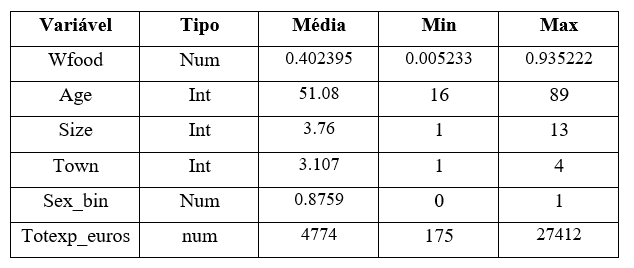


<p> Cada família gasta em media, 40% do seu rendimento total em alimentação, com uma mediana de 39%, às despesas de alimentação. O rendimento mensal apresenta uma média de 4774 euros e uma mediana de 4139 euros, o que demonstra que a média é acrescida por valores extremos superiores. O rendimento mensal varia
    entre os 175 e os 27412 euros. O tamanho de um agregado varia entre 1 a 13 pessoas,
    possuindo em média, aproximadamente 4 pessoas. Podemos verificar também que, em media, a pessoa
    de referencia em cada agregado familiar possui 51 anos de idade. A amostra retirada do dataset é
    predominantemente constituída por homens (cerca 88%) e cujos agregados familiares residem em 
    cidades de dimensão média (3).
 </p>

<br>

<p> Para verificar a existência de valores extremos nas nossas variáveis recorremos a boxplots, que fizemos apenas para as variáveis não categóricas. A variável <b class="red">wfood</b> apresenta alguns outliers, no entanto o seu afastamento não é tão extremo em relação ao de outras variáveis.      No boxplot da variável
    <b class="green">totexp_euros</b> os outliers são, comparativamente às restantes variáveis, os que
    apresentam maior afastamento para valores superiores em relação à maioria dos valores. Este 
    detalhe chamou a nossa atenção para averiguar a influência dos outliers.
    Já a variável
    <b class="blue">age</b> não apresenta outliers. A variável <b class="orange">size</b>, à
    semelhança da variável <b class="red">wfood</b>, apresenta poucos outliers e não muito afastados.
    Podemos ainda realçar que os outliers das nossas variáveis são valores extremos superiores.</p>

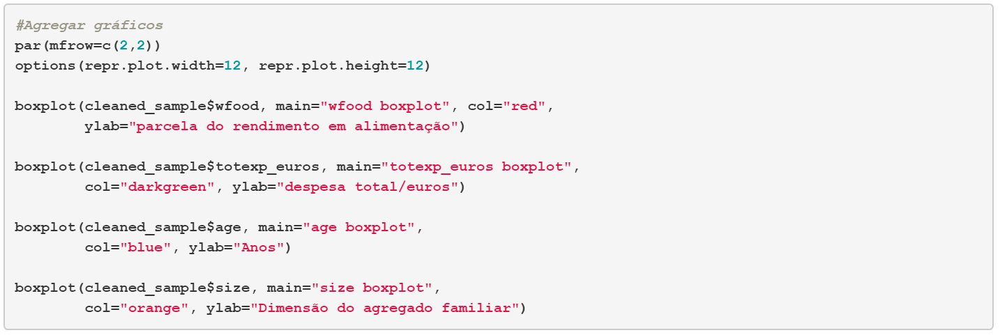

<br>

<p style="margin-left: 21%;"> Imagem 4 - Boxplots das variáveis </p>
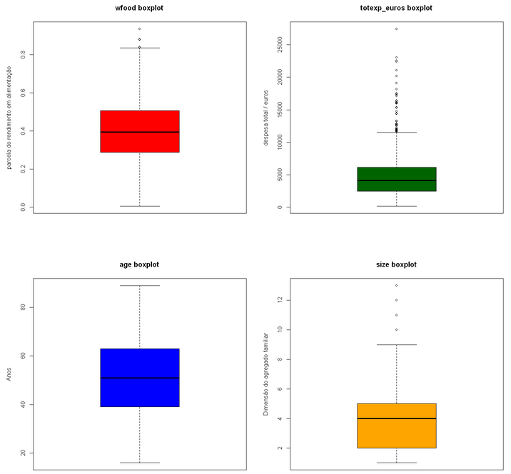

<br>

<p> De seguida decidimos averiguar a correlação entre todas as variáveis, de modo a
    entender a relação das variáveis independentes com a dependente (target) e verificar
    se existe multicolínearidade entre as variáveis independentes. Na imagem 5 temos uma tabela de 
    correlação, que recorre a valores numéricos para explicar as relações entre as variáveis. 
    A imagem 6 é uma matriz correlação que expressa num formato gráfico as mesmas relações. </p>
  
```{r}

corr_table = cor(cleaned_sample[-c(1)])

```   
  
<br>

<p style="margin-left: 21%;"> Imagem 5 - Tabela de correlação </p>
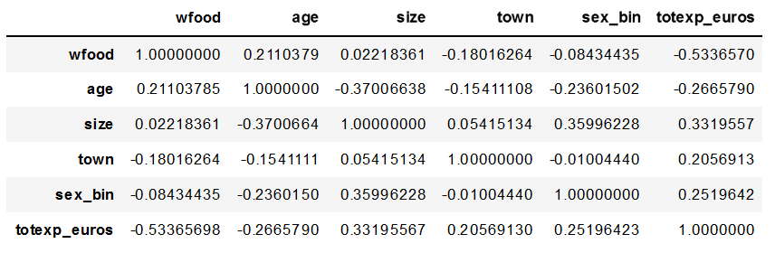

<br>
<p style="margin-left: 31%;"> Imagem 6 - Matriz de correlação </p>

```{r}
 corr_matrix = corrplot(cor(sample[c(2,4,5,6,8,9)]), type='upper')

```   

<br>

<p>Através da análise de ambas as figuras concluímos o seguinte: </p>
    
  <ul>
    <li> As correlações com a variável dependente são fracas e uma única moderada.</li>
    <li> A variável que apresenta maior relação com a <b class="red">wfood</b> é
         a <b class="green">totexp_euros</b>, sendo que essa correlação é moderada
         negativa. Portanto, a correlação indica, à partida, sem outro processamento            sobre os dados, que à medida que o rendimento direcionado para despesas diminui, a proporção desse rendimento que é gasto em alimentação aumenta. 
         O que a senso comum faz  todo o sentido, visto que os agregados com menores            rendimentos vão despender uma maior parte do seu orçamento em alimentação.</li>
    <li> A variável  <b class="pink">sex_bin</b> tem uma correlação muito baixa com a variável 
         <b class="red">wfood</b> (-0.084), o que pode estar relacionado com a fraca                            representatividade dos dois sexos na amostra.</li>
    <li> Não existem correlações elevadas entre as variáveis independentes.</li>
  </ul>
  
<br>  

<p> Para finalizar a análise das nossas variáveis vamos recorrer a gráficos de dispersão
    para ver como se relacionam as variáveis independentes com a dependente. Abaixo
    está apresentado o código utilizado para o scatter plot entre a variável <b class="red">wfood</b>
    e a <b class="green">totexp_euros</b>. Os restantes gráficos foram obtidos através de códigos
    semelhantes para as variáveis correspondentes, por isso não os incluímos neste relatório.</p>
 
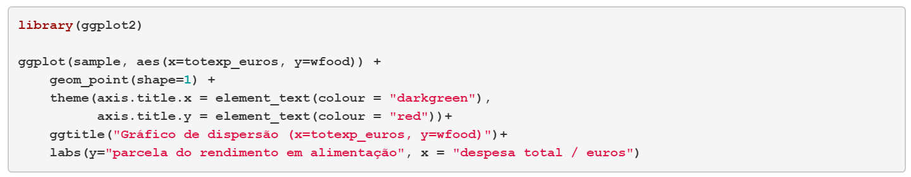
    
<p style="margin-left: 20%;"> Imagem 7 - Gráficos de dispersão </p>
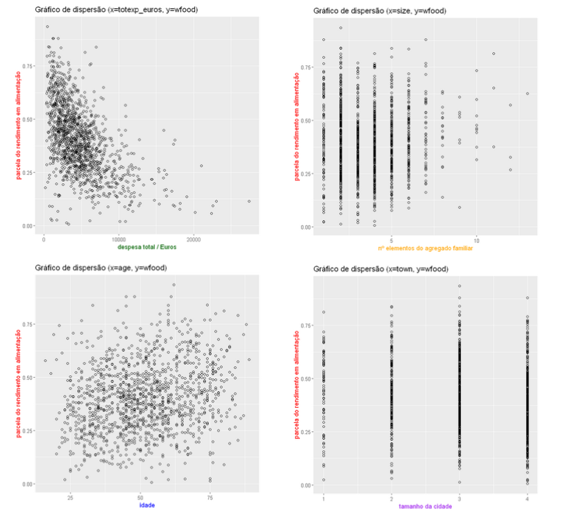
                                         
<br>

<p> Ao analisar os gráficos de dispersão entre a variável dependente (também conhecida como a
target) <b class=red>wfood</b> , em conjunto com as variáveis independentes (também conhecidas como features) <b class=green>totexp_euros</b>,
<b class="blue">age</b>, <b class="orange">size</b> e <b class="purple">town.</b></p> 

<p>O gráfico de <b class=red>wfood</b> em função de <b class=green>totexp_euros</b> apresenta uma nuvem de dados com uma tendência linear negativa, 
verificado pelo valor de correlação de -0.53, no entanto esta distribuição é um pouco difusa.</p>

<p>O gráfico de <b class=red>wfood</b> em função de <b class="blue">age</b> a sua dispersão apresenta uma ausência de padrão verificado pelo valor
fraco de correlação de 0.21.</p>

<p>No gráfico de <b class=red>wfood</b> em função de <b class="orange">size</b> a variável é categorica e há ausência de um padrão linear na nuvem de pontos, existindo uma concentração dos pontos em torno do valor 4, como é verificado na análise descritiva.</p>

<p>À semelhança do anterior, o gráfico de <b class=red>wfood</b> em função de <b class="purple">town.</b> a variável é categórica e há ausência de um padrão
línear na nuvem de pontos, existindo uma concentração dos pontos em torno do valor 3, como é verificado na análise descritiva.</p>

</div>

<br>

<h3><b> Primeiros modelos: </b></h3>
<div style="border: solid; border-width: 1px; border-color: #cccccc; padding: 10px;border-radius: 10px; background-color:white;">

<p> O nosso modelo base `fit0` é um modelo de regressão línear múltipla, no qual utilizamos
    todas as variáveis disponíveis, com o intuito de prever a <b class="red">wfood</b>. 
    Depois vamos utilizar duas funções do package olsrr, que com base no AIC e no 
    p-value vão devolver as variáveis que constituem o melhor modelo.</p>

```{r}

info = cleaned_sample[-c(1)]
fit0 = lm(wfood ~., data=info)

best_model_p = ols_step_both_p(fit0)
best_model_aic = ols_step_both_aic(fit0)

```     

<p>Ambas as funções devolveram o mesmo modelo. Um modelo constituído pelas variáveis
   <b class="green">totexp_euros</b>, <b class="blue">age</b>,
   <b class="purple">town</b> e <b class="orange">size</b>. A variável que ambas
   as funções consideram não significante é a variável <b class="pink">sex_bin</b>. 
   Com base nessa informação construímos o nosso primeiro modelo `fit1`, sem a variável
   <b class="pink">sex_bin</b>. Vamos analizar esse modelo em relação à significância 
   das variáveis e aos pressupostos dos resíduos:</p>

```{r}

info1 = cleaned_sample[-c(1,6)]
fit1 = lm(wfood ~., data=info1)
summary(fit1)
``` 

<p> Todas as variáveis são significantes para o modelo, sendo que todas apresentam
    um p-value muito próximo de zero, à exepção da variável <b class="purple">town</b> 
    que tem um p-value de 0.0193. O r-squared é baixo, apenas 35,29% da variância 
    da variável wfood é explicada pelo modelo línear. Vamos analisar os pressupostos
    dos resíduos: </p>
    
```{r}
mean_r1 = mean(fit1$residuals)               # Verificado
bptest1 = bptest(fit1)                       # Não verificado
bgtest1 = bgtest(fit1)                       # Não verificado
jbtest1 = jarque.bera.test(fit1$residuals)   # Não verificado

```        

<p> O pressuposto da média nula dos resíduos é verificado, visto que o seu valor é
    um zero estatístico. Também podíamos verificar este pressuposto olhando para o 
    nível de significância do parâmetro intercept.</p>
<p> Os restantes pressupostos não se verificam, visto que os p-values dos testes são,
    em todos os casos, menores do que 0.05. Como as hipóteses nulas destes 3 testes
    representam o próprio pressuposto o objetivo é não rejeitar H0, ou por outras
    palavras, obter um p-value superior a 0.05. 
    Vamos visualizar os gráficos relativos aos resíduos do modelo para entender 
    melhor o seu comportamento. </p>

<p style="margin-left: 25%;"> Imagem 8 - Gráficos relativos aos resíduos do modelo fit1 </p>
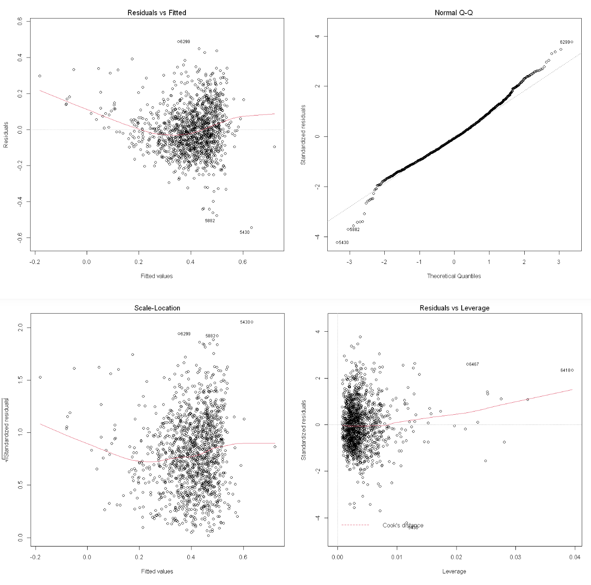

<p> Na análise a estes gráficos podemos identificar:</p>

<ul>
<li>
Os números 6299, 5882, 5430 como os mais problemáticos para o nosso
modelo.</li>
<li>Podemos verificar que existem resíduos muito destacados, compreendendo que
existem observações atípicas, que estão afectar o seu ajustamento.</li>

<li>Podemos notar que o 1º e 3º gráfico têm ambos um padrão não aleatório
em U, sendo que ambos têm uma curvatura na disposição dos seus resíduos,
o que indica uma violação na hipótese de linearidade entre os Residuals e
os Fitted Values (no caso do 1º gráfico).</li>

<li>Distribuição não normal dos resíduos do gráfico QQ. Podemos reparar ainda que
temos um grande número de outliers que criam uma espécie de "caudas gordas".
Ficando uma maior normalidade.</li>

<li>Nota-se ainda que de acordo com o gráfico "Residuals vs leverage", percebemos que existem
influenciadores, com um impacto suficiente para criar uma ligeira curvatura.
Concluímos que ainda existe muita informação para extrair dos nossos dados.</li>

</ul>  

<p> Através da análise dos gráficos notámos a presença de valores extremos que podem
    estar a influenciar o nosso modelo. Para avaliar melhor esta situação vamos realizar 
    uma análise para encontrar os valores que mais influenciam o modelo.</p>
    
    
</div>

<br>

<h3><b> Tratamento de outliers: </b></h3>
<div style="border: solid; border-width: 1px; border-color: #cccccc; padding: 10px;border-radius: 10px; background-color:white;">
  <p> Como foi referido na secção anterior é possível que existam valores que estão
      a influenciar o modelo, desses valores vamos verificar os que apresentam valores
      que consideramos inadequados e eliminar essas linhas.</p>
      
<div style="margin-left: 12%;margin-right: 12%;">
<p style="margin-left: 25%;"> Imagem 9 - Avaliação dos influenciadores </p>
```{r}
influenceIndexPlot (fit1, id=list(n=5))
```        
</div>
<p> Neste gráfico são cálculados os 5 valores mais influenciadores do modelo utilizando 
    4 métodos, como a distância de cook's e o Bonferroni p-value. Podemos observar que 
    existem valores que surgem mais do que uma vez nos quatro gráficos: 
</p>
<p style="margin-left:35%;"> [ 5334, 5430, 5882, 6299, 6418, 6429 ]</p>
<p> Vamos ver o porquê de estes valores serem considerados influeciadores e verificar
    se existem motivos suficientes para os retirar do modelo.</p>
    
```{r}
influentials1 = cleaned_sample[cleaned_sample$X %in% c(5334, 5430, 5882, 6299, 6418, 6429),]
influentials1
```          
<p> Apenas com base nesta análise podemos concluir que existem pelo menos 3 linhas 
    que parecem apresentar valores não reais:
    <ul>
    <li>5334 - Gasta cerca de 1090 euros em comida por mês, o que é um valor muito elevado,
               visto que o agregado é apenas constituído por 1 pessoa e o valor
               corresponde a 88% do rendimento.</li>
    <li>5430 - O agregado familiar é constituído por 9 individuos e a percentagem gasta 
        em alimentação é apenas de 9,17%.</li>
    <li>5882 - O gasto em alimentação mensal corresponde apenas a 25 euros.</li>
    <li>6429 - O agregado familiar gasta por mês 43,68 euros para alimentar 4 pessoas. </li>
    <li>6418 - Variável totexp_euros muito elevada.</li>
    </ul>
</p>    
<p> Agora vamos encontrar todas as linhas que apresentam uma distância de Cook maior do
    que quatro vezes a média de todas as distâncias de Cook. Vamos guardar todas essas
    linhas numa lista e analisá-las uma a uma para concluir quais retirar do modelo. 
    Para tornar a nossa análise mais eficiente vamos adicionar uma coluna ao dataframe, 
    que representa o gasto percapita em alimentação por mês. </p>   
    
```{r}
cooks_distance <- cooks.distance(fit1)

influential <- as.numeric(names(cooks_distance)[(cooks_distance > 4 * mean(cooks_distance))])

influenciadores = BudgetFood[influential,]

for (i in c(0:length(influenciadores[,1]))) {
    influenciadores[i,3] = influenciadores[i,3] * 6 / 1000
  }


percapita = c()
    
for (i in c(0:length(influenciadores[,1]))) {
    percapita[i] = influenciadores[i,2] * influenciadores[i,3] / influenciadores[i,5]
}

influenciadores["percapita"] = percapita

influenciadores[influenciadores$X %in% c(5384, 5427, 5430, 5882, 6014, 6018, 6299, 6418, 6429),]

```

<p> Utilizando este método foram encontradas 61 linhas influenciadoras. Decidimos 
    utilizar o seguinte critério: o valor minímo aceitável para a variável percapita é de 
    25 euros mensais destinados a despesas de alimentação. Deste modo foram selecionadas
    as seguintes linhas:
    <ul>
      <li>5384 - percapita = 18.7200 euros</li> 
      <li>5427 - percapita =  9.0480 euros</li>
      <li>5430 - percapita =  7.2800 euros</li>
      <li>5882 - percapita =  24.9600 euros</li>
      <li>6014 - percapita =  4.2900 euros</li>
      <li>6429 - percapita =  10.9200 euros</li>
    </ul>
</p>

<p>Para eliminar as linhas influenciadoras da nossa sample utilizámos um truque de 
   fazer a negação do operador`%in%`. Deste modo conseguimos criar uma sample com
   todas as linhas menos as 9 linhas que queríamos eliminar. </p>
```{r}

`%notin%` <- Negate(`%in%`)
final_sample = cleaned_sample[cleaned_sample$X %notin% c(5384, 5427, 5430, 5882, 6014, 6018, 6299, 6418, 6429),]
                                                         
```

<p> No total foram eliminadas apenas 9 linhas, o que representa uma perda de 0,692%
    dos dados. Agora que foram removidos os valores que mais influenciavam o 
    modelo vamos verificar se o modelo `fit1` melhorou com esta intervenção.</p>

</div>

<br>

<h3><b> Modelos: </b></h3>
<div style="border: solid; border-width: 1px; border-color: #cccccc; padding: 10px;border-radius: 10px; background-color:white;">

<p> Para verificar se o modelo `fit1` melhorou criámos o `fit2`, que utiliza a mesma formula,
    mas tem como input o dataframe `final_sample`, criado na secção anterior. Deste modo será
    possível a comparação das diferentes medidas relativas aos dois modelos.</p>
    
```{r}

info2 = final_sample[-c(1,6)]
fit2 = lm(wfood ~., data=info2)
summary(fit2)


AIC(fit1, fit2)
``` 
<p> O modelo `fit1` apresenta um R-squared de 0.3529 e um Adjusted R-squared de 0.3509. Após a remoção dos
    outliers ambos os valores subiram, para 0.382 e 0.3801, respectivamente. O AIC também melhorou, passando de 
    -1619.207 no `fit1`, para -1701.849 no `fit2`. Através desta análise concluímos que ao eliminar valores 
    influenciadores melhorámos o modelo. </p>
    
<p> De seguida, com o objetivo de verificar se ainda existem muitos valores influenciadores
    no dataframe `final_sample`, decidimos recorrer à regressão línear robusta `fit2_robust` para comparar os 
    t-values dos seus coeficientes com os do modelo de regressão línear `fit2`. Esta análise é 
    interessante, visto que, a regressão línear robusta utiliza pesos, baseados nos resíduos, com
    o objetivo de ter menos em conta valores com resíduos muito elevados. Portanto, caso ainda 
    existam muitos valores influenciadores, o modelo `fit2` e o `fit2_robust` vão ter t-values
    muito diferentes para os seus coeficientes. </p>  
    
``` {r}

fit2_robust = rlm(wfood ~., data=info2)
summary(fit2_robust)
```
<p> A diferença entre os t-values do modelo `fit2`e do `fit2_robust`é muito reduzida, logo
    existem poucos valores influenciadores no dataframe `final_sample`.</p>

<p> O modelo `fit3` utilizou-se uma função de transformação de raíz quadrada na variável target. Este modelo apresenta um R-squared de 0.4165. Após a transformação na variável target o valor R-squared aumentou e o AIC também melhorou, passando a ser -2284.434 o que é benéfico para a escolha do modelo. </p>
```{r}
# Modelo 3 fit3
fit3 = lm(sqrt(wfood)~., data=info2)
summary(fit3)

AIC(fit2, fit3)

```

<p> O modelo `fit4` alterou em relação ao modelo `fit3` pelo o uso da variável <b class=pink>sex_bin</b> em combinação com uma variável do modelo anterior. Este modelo apresenta um R-squared de 0.422. Após a adição da feature no modelo o valor R-squared aumentou e o AIC também melhorou, passando a ser -2292.646. </p>  
```{r}
# Modelo 4
info3 = final_sample[-c(1)]
fit4 = lm(sqrt(wfood) ~ totexp_euros*sex_bin+size+age+town ,data=info3)
summary(fit4)

AIC(fit3, fit4)
```

<p> O modelo `fit5` alterou em relação ao modelo `fit4` com o uso da variável <b class=orange>size</b> ao quadrado passando a ser uma regressão polinomial de grau dois. Este modelo apresenta um R-squared de 0.4266. Após a modificação ao modelo o valor R-squared aumentou e o AIC também melhorou, passando a ser -2300.877. </p>  

```{r}
# Modelo 5
fit5=lm(sqrt(wfood)~totexp_euros*sex_bin+size+I(size^2)+age+town, data = info3)
summary(fit5)

AIC(fit3, fit4, fit5)
```

<p> No modelo `fit5a` em relação ao modelo `fit5` sofreu uma modificação pelo recurso a pesos na regressão linear na elaboração do modelo baseados na dimensão do vetor target. Este modelo apresenta um R-squared de 0.5094. Após a modificação ao modelo o valor R-squared aumentou mas o AIC piorou, passando a ser -1491.016. O que indicou uma inadequação do tipo de pesos utilizados. </p> 
```{r}
# Modelo 5a
N=length(info3$totexp_euros)

fit5a=lm(sqrt(wfood)~totexp_euros*sex_bin+size+I(size^2)+age+town, data = info3, w=1/((1:N))^0.9)
summary(fit5a)

AIC(fit3, fit4, fit5,fit5a)
```
<p> No modelo `fit6` alterou-se o modelo `fit5a` fazendo a raíz quadrada do quociente da variável target <b class=red>Wfood</b> pela feature <b class=orange>size</b>, obtendo valores per capita, utilizando como pesos na regressão linear os valores obtidos da regressão linear robusta. Este modelo apresenta um R-squared de 0.7948. Após a modificação ao modelo o valor R-squared aumentou consideravelmente e o AIC passou a ser -3735.558, o valor passou a ser o menor dos modelos demonstrando uma adequação do tipo de pesos utilizados.
</p> 
```{r}
# Modelo 6
get_weight_model = rlm(sqrt(wfood/size)~totexp_euros*sex_bin+size+I(size^2)+age+town, data = info3)

residuals = get_weight_model$resid
weights = get_weight_model$w

fit6=lm(sqrt(wfood/size) ~ totexp_euros*sex_bin + size + I(size^2) + age + town, data = info3, w=weights)
summary(fit6)


AIC(fit3, fit4, fit5, fit6)
```

<p> Finalmente no modelo `fit6a` alterou-se o modelo `fit6` utilizando como pesos na regressão linear os resíduos do modelo fit6. Este modelo conservou um R-squared de 0.7948. Após a modificação o AIC passou a ser -5323.239, o valor passou a ser o menor de todos os modelos, sendo assim o melhor de todos os modelos elaborados.
</p> 

```{r}
# Modelo 6a
N=fit6$residuals^2

fit6a=lm(sqrt(wfood/size) ~ totexp_euros*sex_bin + size + I(size^2) + age + town, data = info3, w=1/N)
summary(fit6)


AIC(fit3, fit4, fit5, fit6,fit6a)
```

</div>

<br>

<h3><b> Previsão in Sample: </b></h3>
<div style="border: solid; border-width: 1px; border-color: #cccccc; padding: 10px;border-radius: 10px; background-color:white;">

<p>O desempenho de previsão de cada modelo é avaliado com recurso ao MAPE, que indica o erro percentual absoluto médio associado a cada previsão, utilizando os valores reais (actual) da amostra e os valores previstos pelo modelo (predicted) e ao RMSE, que indica a variância. Menores valores, tanto para o MAPE como para o RMSE, indicam previsões com menor erro, pelo que indicam melhor capacidade de previsão. Apesar de existirem funções que realizam o MAPE e o RMSE automáticamente, efetuamos os seguintes códigos para a sua determinação.</p>

```{r}

# Predição dos valores do modelo fit2
predicted2 = predict(fit2)
actual2 = info2$wfood

n = length(predicted2)

MAPE2 = (1/n) * sum(abs((actual2 - predicted2)/actual2)) * 100
MAPE2

RMSE_2=sqrt((sum((predicted2-actual2)**2)/n))*100
RMSE_2
``` 


<p style="margin-left: 20%;"> Imagem 10 - MAPE e RMSE da previsão in sample (em %) </p>
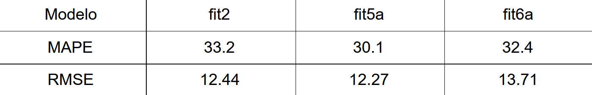

<p> Podemos verificar que o modelo que possui o menor erro de previsão in sample é o fit5a, já que possui os menores valores, tanto a nível do MAPE como do RMSE.
Por este motivo, podemos afirmar que o modelo fit5a possui o melhor desempenho de previsão in sample. </p>

</div>

<br>
<h3><b> Previsão out of Sample: </b></h3>
<div style="border: solid; border-width: 1px; border-color: #cccccc; padding: 10px;border-radius: 10px; background-color:white;">
<p>De modo a elaborar uma previsão out of sample com os valores fornecidos, para o trabalho prático, foi necessário dividir em subconjuntos de treino e de teste os dados do dataset. Para realizar a divisão com o comando `sample.split` foi colocado o valor de 0.8 para subdividir em 80% os dados para o subconjunto de treino. O subconjunto de treino foi utilizado para formular os modelos fit2, fit5a e fit6a meramente com estes dados. O comando `set.seed` foi utilizado para fixar os valores aleatórios de modo a realizar uma análise constante. </p>

```{r}
set.seed(45234657)
split2 = sample.split(info2, SplitRatio=0.8)

# Subconjunto de treino para o modelo
training_set2 = info2[split2,]

# Subconjunto de teste para a previsão
test_set2 = info2[!split2,]
```
<p style="margin-left: 20%;"> Imagem 11 - MAPE e RMSE da previsão out of sample (em %) </p>
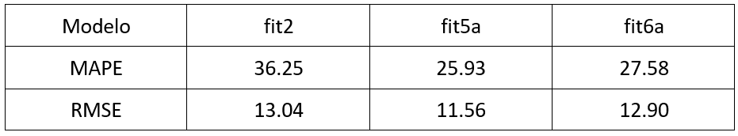
<p>Os resultados out of sample melhoram nos modelos fi5a e fit6a em relação aos valores obtidos in sample, demontra uma capacidade de lidar com novos dados. O modelo fit 2 piora a sua previsão com um conjunto de treino menor. Em termos de previsão, o modelo fit5a mantêm o melhor comportamento em relação aos restantes modelos.</p>  

</div>

<br>

<h3><b> Discussão Final: </b></h3>
<div style="border: solid; border-width: 1px; border-color: #cccccc; padding: 10px;border-radius: 10px; background-color:white;">

<p> Após todas as análises desenvolvidas nas secções "Previsão in Sample" e "Previsão out of Sample" vamos discutir os resultados e      apresentar o melhor modelo, para o selecionar recorremos a diferentes indicadores, apresentados na tabela seguinte:</p>

<p style="margin-left: 20%;"> Imagem 12 - Tabela com indicadores relativos aos modelos fit2, fit5a e fit6a </p>
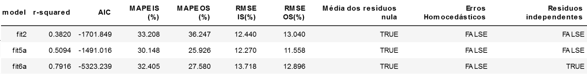

<p>O modelo fit6a possui o melhor valor a nível do R-Squared (0.7916), o que significa que é o modelo que possui uma maior variância explicada para a variável dependente <b class="red">wfood</b>. Um R-Squared mais elevado indica que o modelo consegue explicar uma maior percentagem dos dados da variável dependente - sendo portanto aquele que melhor se ajusta aos dados.</p>

<p>Este modelo possui, também, o menor AIC entre os três (-5323.239), sendo portanto o modelo de regressão que possui uma menor perda de informação ao estimar a variável dependente. É, também, o modelo que cumpre o maior número de pressupostos do modelo de regressão linear. O modelo fit6a apresenta verificados os seguintes pressupostos:</p>

<ul>
  <li>Média nula dos resíduos;</li>
  <li>Resíduos independentes;</li>
</ul>

<p> Tendo em conta estes fatores, podemos assumir que este modelo, entre os 3 selecionados, oferece uma maior precisão na modelação dos dados para este dataset, tendo em conta todos os indicadores referidos.</p>

<p> Apesar de ser o mais preciso, não é, no entanto, o modelo que possui a maior capacidade de previsão, o que se pode verificar         pelos valores do MAPE e RMSE. O modelo fit5a possui os melhores valores, tanto a nível do MAPE como a nível do RMSE, sendo           portanto aquele que possui melhor desempenho a nível de previsão, tanto in sample (MAPE - 30.148%) como out of sample (MAPE -         25.926%), como se pode verificar na tabela. Este modelo, apesar de ter maior capacidade de previsão, possui um R-Squared de 50%, e    o valor de AIC mais elevado entre os três modelos, sendo portanto menos preciso e possuindo um pior ajuste para os dados. </p>

<p>Pelas razões a cima indicadas adotámos o modelo fit6a como modelo final.</p>

<p style="margin-left: 22%;"> Imagem 13 - Fórmula e parâmetros do modelo fit6a </p>
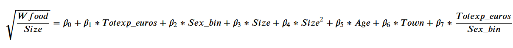
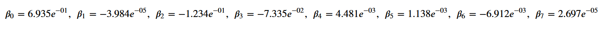

<p>Na secção "Gráficos de previsão" são apresentados gráficos relativos às previsões in e out of sample do modelo escolhido. </p>
</div>

<h3><b> Gráficos de previsão: </b></h3>
<div style="border: solid; border-width: 1px; border-color: #cccccc; padding: 10px;border-radius: 10px; background-color:white;">

<p style="margin-left: 22%;"> Imagem 14 - Gráfico da previsão in sample do modelo fit6a (200 amostras) </p>
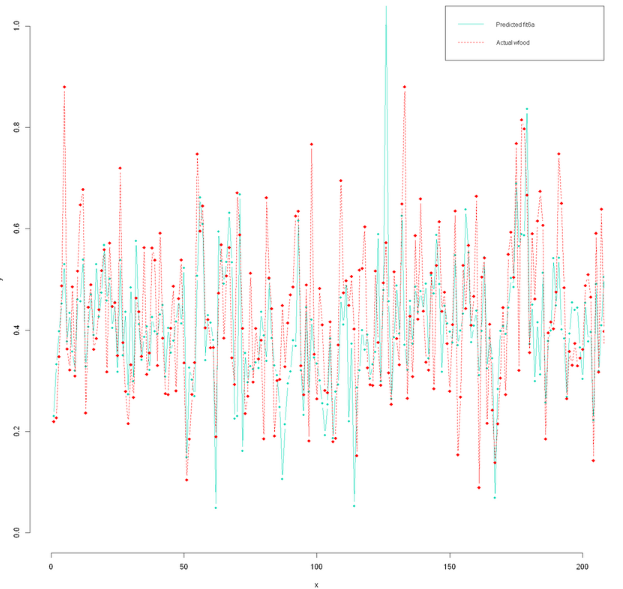

<br>

<p style="margin-left: 22%;"> Imagem 15 - Gráfico da previsão in sample do modelo fit6a (50 amostras) </p>
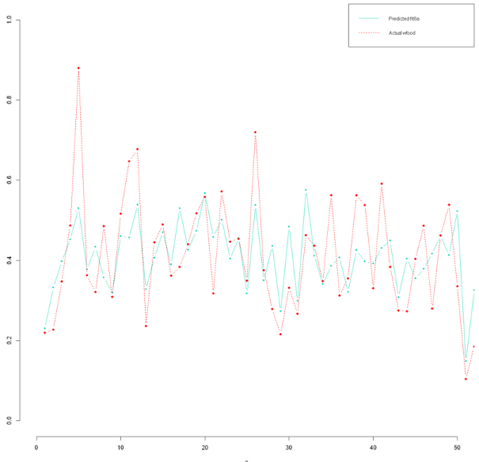

<br>

<p style="margin-left: 22%;"> Imagem 16 - Gráfico da previsão out of sample do modelo fit6a (200 amostras) </p>
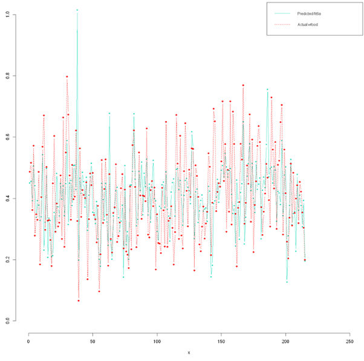

<br>

<p style="margin-left: 22%;"> Imagem 17 - Gráfico da previsão out of sample do modelo fit6a (50 amostras)</p>
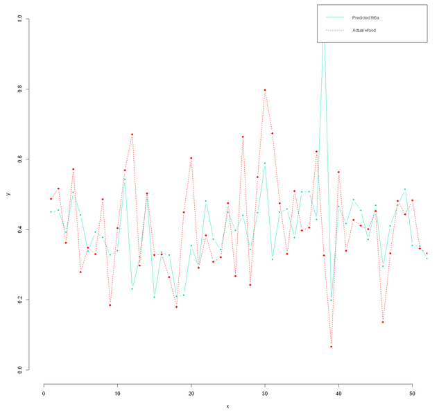

<br>

</div>

</div>


